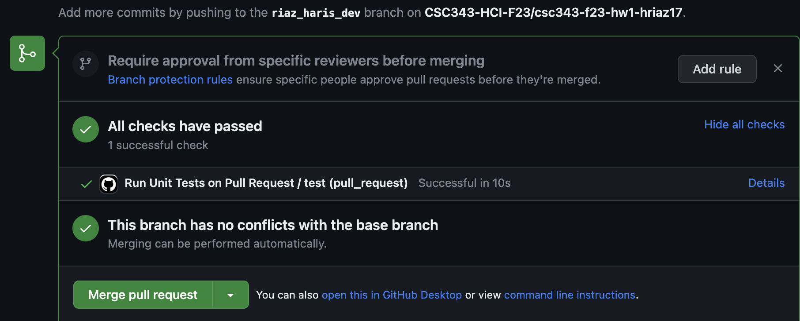

## Setting Up Node.js and npm Environment

This guide will help you set up your environment for JavaScript development using Node.js and npm, which is required for this homework.

## Prerequisites

Before you begin, make sure you have the following installed on your system:

- [Node.js](https://nodejs.org/en/): A JavaScript runtime that lets you run JavaScript on the server.

## Setup

Follow these steps to set up your environment:

1. **Install Node.js and npm:**

    Visit the official Node.js website and download the installer for your operating system. The installer will also install npm by default.

    - [Download Node.js](https://nodejs.org/en/download/)

2. **Verify Installation:**

   After installation, open your terminal and run the following commands to verify that Node.js and npm are installed:

   ```sh
   node -v
   npm -v

3. **Checkout a new branch:**

    Before you start editing any code, you will need to create a new branch in your GitHub repository to hold your work.

    - You will be given a link generated by GitHub Classroom. Click on the link and follow the instructions there. Github classroom should create a corresponding repository for you containing JS starter code.
    - Go to the repository that GitHub Classroom created for you. It should look like `https://github.com/CSC343-HCI-F23/csc343-f23-hw1-<your-username>`, where`<your-username>` is your GitHub username. 
    - Create a [branch](https://help.github.com/articles/creating-and-deleting-branches-within-your-repository/) through the GitHub interface.
    - Name your `<branch>` as `yourlastname_yourfirstname_dev` (**very important , do NOT name it anything else**)
    - Clone the repository to your local machine and checkout the branch you
     just created. Your command must be similar to :
     ```
     git clone -b <branch> https://github.com/CSC343-HCI-F23/csc343-f23-hw1-<your-username>.git
     ```

4. **Install dependencies:**

    To install all the dependencies specified in the `package.json` file, navigate to the root of the repository that you cloned from GitHub and run the following command:

    ```
    npm install
    ```

5. **Write your code:**
    You will implement one function each for each of the sub questions in the programming part of the assignment, Eg:`readGraphFromJSON(filePath)` inside the class `GraphClass`(./index.js)

    For Problem 4, you must compute a node degree histogram in the `calculateDegreeHistogram()` function. The `displayHistogram()` function should support rendering the histogram in the Google Chrome browser. Use an HTML file named `index.html` to achieve this.

    Also, you **should not edit** these files:
    - `./tests.js`
    - `./imdb_data.json`
    - `./test_data.json`
    - `.github/workflows/run-tests-on-pull.yml`
    - `package.json`
    - `package-lock.json`

    **Note: The file `./imdb_data.json` is the input dataset file you must use as per hw1 guidelines. Please don't edit it or move it. The same applies to `./test_data.json`**

6. **Test your code:**
    Tests have been provided for you in the `./tests.js` file.
    To run all the provided tests, just type/run  ``npm test`` from command line from the root of the repository.

    If your code passes the test cases, you will see output like:
    ```
      Graph Class
    ✔ test 1: should correctly read and populate nodes from a JSON file
    ✔ test 2: should correctly add edges based on links in data
    ✔ test 3: should correctly compute node degrees and add attributes
    ✔ test 4: should correctly calculate degree histogram


    4 passing (1ms)
    ```
7. **Submitting your code:**

    As you are working on the code, you should regularly `git commit` to save your current changes locally and `git push` to push all saved changes to the remote repository on GitHub.    

    To submit your assignment, [create a pull request on GitHub](https://help.github.com/articles/creating-a-pull-request/#creating-the-pull-request), where the "base" branch is "master" or "main", and the "compare" branch is the branch you
    created at the beginning of this assignment.
    Then, go to the "Files changed" tab and make sure that all your changes look as you would expect them to.

    There are test cases that will be run automatically (via [Github Actions](https://github.com/features/actions)) when a pull request is submitted. These are the same as `npm test`. 
    So if your code passed `npm test` in your machine, it’s highly likely that it will pass in GitHub. Nevertheless, you should make sure that you see a green tick mark or a message saying “All Checks Have Passed” like this:

    

    If your test cases are failing, you will get an error message saying "All Checks Have Failed".

    Click on the link which says `details` and find out what is causing the issue or which test case is not passing. Once you have identified that, close the pull request, fix the errors, and raise another pull request.
    
    **Do not merge the pull request.**

    Your instructor will grade the code of this pull request. Pull requests submitted after the deadline won’t be considered. You don't have to submit the code on D2L.

8. **Grading:**

    The programming parts of this assignment will be graded primarily on their ability to pass the tests that have been provided to you on GitHub after the pull request. Assignments that pass all, and with the corresponding code implementing the correct logic, will receive at least 30 points.

    To get the remaining of the points, you will be evaluated for correct code implementations to answer the five sub questions in the programming part and whether you generated a correct interpretable histogram of node degrees vs node counts.